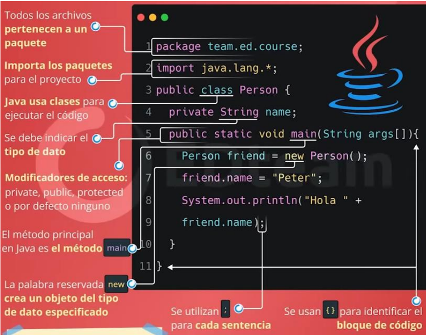

# CLASE 01

_30-04-2024_

## **Comandos básicos en Visual Estudio Code**

Todos los comandos a continuacion son ejecutables en windows:

- **CTRL + SHIFT + P**: Abre la paleta de comandos.
- **CTRL + P**: Abre el buscador de archivos.
- **CTRL + B**: Abre y cierra la barra lateral.
- **CTRL + D**: Activa el multi-cursor.
- **SHIFT + ALT + UP / SHIFT + ALT + DOWN**: Seleccionar toda la linea de codigo.
- **SHIFT + ALT + A**: Comentar varias lineas de codigo.
- **CTRL + K + C**: Comentar una linea de codigo.
- **ALT + ---->**: Retroceder o avanzar.
- **CTRL + T**: Mostrar comandos.
- **CTRL + ESPACIO**: Sugerencias de activacion.

---

<br>

# CLASE 02

_01-05-2024_

## **Markdown**

Es un lenguaje de marcado, su extension es ".md", se usara para anotar los apuntes de la clases y se puede transformar a pdf.
Tiene varias funcionalidades para resaltar de diversas formas las partes del texto.


### **Colocar imagenes**

    ![Nombre alternativo] (ruta de acceso de la imagen)

### **Colocar lineas de codigo**

```c++
int main (){
    cout << "Esto es un ejemplo"<<endl;
}
```

<br>

## **GIT**

Herramienta con la cual podremos subir nuestros codigos a repositorios en linea, que facilita el compartido de los mismos, a continuacion los comandos mas usados:

### **Identidad del usuario**

```
git config --global user.name “pat_mic“
```

```
git config --global user.email pat_mic@hotmail.com
```

```
git config user.email
```

```
git config user.name
```

### **Control de versiones**

```
git init
```

```
git status
```

```
git add .
```

```
git add NombreCarpeta/NombreArchivo.ext
```

```
git commit -m 'mensaje : initial project version'
```

### **Control de versiones - clonando**

```
git clone https://github.com/xxyyy/abc
```

```
$ git clone https://github.com/xxyyy/abc miPropioNombre
Touch (crear archivos)

```

### **Quitar archivos del control**

```
echo ”nombreArchivo.ext” >> .gitignore
```

```
echo ”*.txt” >> .gitignore
```

### **Ver archivos ignorados**

```
cat .gitignore
```

### **Ver archivos ignorados**

```
git add -f NombreArchivo.log
```

### **Crear y clonar**

```
git init
```

```
git clone /ruta del repositorio
```

---

# CLASE 03

_06/05/2024_

## JAVA

- Origen

**Como funciona:**

1. Codigo
2. Compilacion
3. Bytecode
4. JVM
5. Multiplataforma.

**Sabores de JAVA**

- Java Micro Edition.
- Java Standar Edition.
- Java enterprise Edition.

**Sintaxis de java**


## Tipos de lenguaje

- **Compilado:** Convierte el codigo a binarios que lee el S.O.
- **Interpretado:** Requiere de un programa que lea la intruccion del codigo en tiempo real.
- **Intermedio:** Se compila el codigo fuente a un lenguaje intermedio y este ultimo se ejecuta en una maquina virtual.

<br>

## Estructurado vs O.O

### Programacion estructurada

- La programacion estructurada tiene **funciones o procedimientos**.
- La programacion estructurada se maneja con **estructuras**.
- La programacion estructurada tiene **variables**.

<br>

### Programacion O.O

- La programacion orientada a objetos tiene **metodos**.
- La programacion orientada a objetos se maneja con **clases**.
- La programacion orientada a objetos tiene **propiedades**.
- Las variables si existen, solo **dentro de los metodos**.

<br>

# CLASE 07

_13-05-2024_

## P.O.O

### 1. Conceptualizacion

Se refiere a la idea que se quiere realizar, se puede dibujar, prototipar, etc.

- Se necesita ponerle un nombre y concretar un significado.
- A los objetos se les puede atribuir dos cosas: caracteristicas o acciones:

**_Caracteristicas:_** propiedades, se debe poder almacenar, y debe almacenar informacion (descripcion precisa del objeto).

**_Acciones:_** metodos, son acciones, verbo, las acciones deben estar ligadas a las propiedades. Tienen parametros (Informacion necesaria para que se cumpla la accion de manera exitosal).

**Ambitos:**

- Public (+)
- Protect (-)
- Friendly (~)
- Protect

### 2. UML

(Lenguaje de modelado unificado) se usan las clases, todo lo conceptualizado se ubica dentro de una clase

## | Clase |

| - edad: float |
+Tipocabello: string
| ~ bailar (cancion:string, tiempomin:int, ritmo:string) : string |
~ tocar (Objeto:string, tiempoMin:int): boolean
+Saltar (AlturaMts: int, cantidad:int):void

Se puede pedir que las acciones devuelvan un valor, que puede ser:

- void: No regresa nada
- String: que regrese una palabra o dato
- Boolean: regrese un valor verdadero o falso.

**_Eventos_**: Situaciones en la que interactua el objeto con otros objetos.

### 3. Codigo

```Java
public class mujer {
    private float edad;
    public boolean tieneojos;

    protected bailar (String cancion, TiempoMin int, String ritmo)
        return "sddsdsds";


}
```

# CLASE 08

_20-05-2024_

## Herencias

1. Diagrama de clase de uso
2. coonvertir en UML

# CLASE 00

_20-05-2024_

## Constructor

- Es un metodo
- Tiene el nombre de la clase
- Siempre es publico
- Esta por defecto, hasta que se lo define.
- Se llaman una sola vez de forma automatica o cuando se instancie.

### Sobrecarga

Particularidad de poder pasar varios parametros
