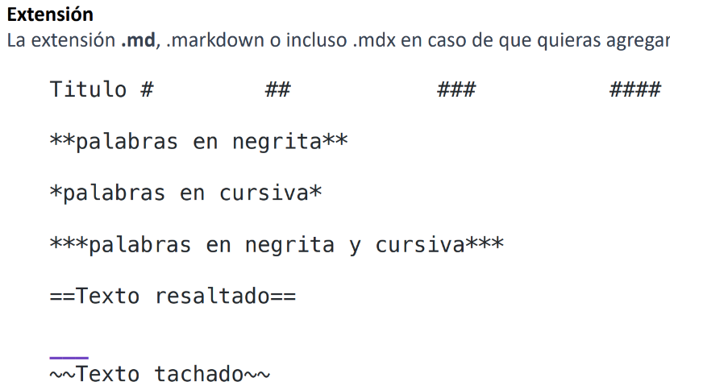
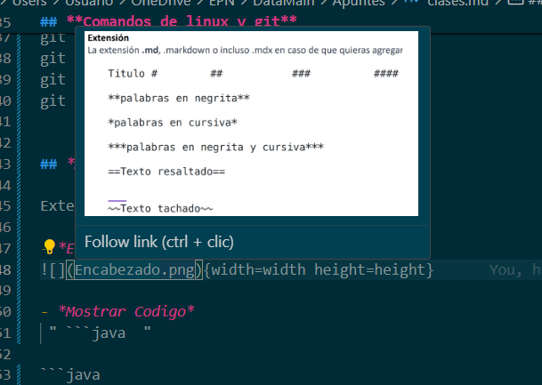

## **Clase01 -- 30 de abril**

**Comando Powershell**
/ri/  Remove-Item -Path holamundo.java   ==remover archivos==   
/ni/  New-Item holamundo.java            ==crear archivos== |  New-Item Clases -type directory  
/mi/  Move-Item holamundo.java -destination "Carpeta"         
/sl/  sl "carpeta"                       ==entrar carpeta==     
/sl/ .. ==regresar carpeta==
/ls/  ls                                 ==Ver Directorio==

**comando de Vscode**
Windows: shift + Ctrl + P           ==llamar directorio o programas==
Windows: shift + Alt + arriba/abajo ==copiar lineas==
Windows: Alt + --> / Alt <--        ==Mover linear/ moverse entre el inicio y final de lineas==
Windows: Ctrl + P                   ==moverse entre archivos==
Windows: Ctrl + B                   ==Ocultar/Mostrar archivos==
Windows: Ctrl + D                   ==Selecionar y editar multiples palabras==
Windows: Ctrl + F                   ==Buscar palabra==
Windows: Ctrl + T                   ==Buscar programas en el repositorio==
Windows: Ctrl + Ñ                   ==Ocultar o aparecer shell==
Windows: Ctrl + L                   ==Limpiar Terminal==

## **Clase02 -- 01 de Mayo**

*Nota:* Alfinal de cada bimbestre se debe entregar un pdf con los apuntes hechos en markdown

## **Comandos de linux y git** 
git init 
git status (Historial de Cambios)
git add . (para chismear todo con el punto)
git commint - m "......" (para guardar)
git push (Enviar documento a la nube)


## *MarkDown Guía*

Extenciones markdown  .md 

- *Encabezados*
{width=width height=height}

- *Mostrar Codigo*
 " ```java  "

```java 

public class HolaMundo {
    public static void main(String[] args)
 {
        System.out.println("¡Hola Mundo!");
    }
}
```

- *Poner imagen*

{width=width height=height}


- Después escribimos, dentro de los corchetes, el texto alternativo. Este es opcional y solo entra en acción cuando no se puede cargar la imagen correctamente.

- Después escribimos, dentro de los paréntesis, la ubicación del archivo (ya sea una url o una ubicación dentro de algun folder local).

Proyecto semana 1: crear un archivo de Markdown en conjunto, resumiendo lo importante visto en la semana subirlo a git hub bajo un repositoriade equipo, adicional cada miembro debe subir sus apuntes de la semana 