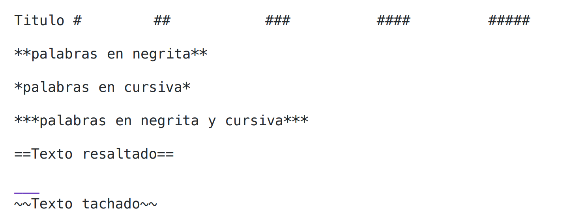

# RESUMEN GRUPAL
## Primera Semana


### *Participantes*

- Mateo Molina
- Francisco Morales
- Daniel Menendez
- Marco Marcillo

<br>

***Recomendaciones iniciales***

- Tener una mecanografía eficiente.
- Emplear comandos para agilizar el manejo de programas.
- Descargar los progremas requeridos y personalizar el entorno.

<br>

***Programas necesarios para el Semestre***
- Java + Extensiones
- git hub/git bash 
- Markdown + Extensiones
- Draw.io + Extensiones
- SQlite ! + Extensiones

<br>

***Personalización del entorno***
- Terminal de Git Bash "oh my posh"
- Tema y Iconos de Vscode "Extensiones"
- Conexión con cuenta de github
- Creación del directorio Principal "Workspace"
- Instalación de extensiones requeridas

<br>

### **Comando Básicos Powershell**
 **==Remover archivos==**
```
/ri/  Remove-Item -Path holamundo.java  
/ni/  New-Item holamundo.java            ==crear archivos== |  New-Item Clases -type directory  
/mi/  Move-Item holamundo.java -destination "Carpeta" 
```

**==Entrar carpeta==**
```
/sl/  sl "carpeta"                       
```


**==Regresar carpeta==**
```
/sl/ .. 
/ls/  
```
**==Ver Directorio==**
```
ls                              
```
<br>

#### **Comando de Vscode**
**==llamar directorio o programas==** 
```Windows: shift + Ctrl + P```
**==copiar lineas==** 
```Windows: shift + Alt + arriba/abajo```
**==Mover linear/ moverse entre el inicio y final de lineas==** 
```Windows: Alt + --> / Alt <--```
**==moverse entre archivos==** 
```Windows: Ctrl + P```
**==Ocultar/Mostrar archivos==** 
```Windows: Ctrl + B```
**==Selecionar y editar multiples palabras==** 
```Windows: Ctrl + D```
**==Buscar palabra==** 
```Windows: Ctrl + F```
**==Buscar programas en el repositorio==** 
```Windows: Ctrl + T```
**==Ocultar o aparecer shell==** 
```Windows: Ctrl + Ñ```
**==Limpiar Terminal==** 
```Windows: Ctrl + L```
**==Eliminar líneas==** 
```Windows: Ctrl + x```
**==Cambio de Pestañas==** 
```Windows: Ctrl + Tab```
**==Doble Espaciado entre lineas==** 
```Windows: Tab```
            

<br>

---
# ***CONCEPTOS BASICOS MARKDOWN*** #
## USOS Y VISUALIZACIONES ##
 ### *1. Texto basicos* ###

---
>[!NOTE]
>
>Este es un cuadro de texto, podemos añadir notas.
>Utilizando ">" al inicio de una linea"
---
>Ejemplo= *pwd:* sirve para visualizar el directorio en el que estamos. 
---
### *2. Bloques de codigos* ###
Utilizamos  **```**  al incio y al final del codigo.
#### *Bloque de codigo JAVA* ####
``` java
public class HolaMundo {
    public static void main(String[] args) {
    System.out.println("Hola mundo");}
}
```
---
#### *Bloque de codigo C* ####
```c
int main{
printf hola mundo
return 0
}
```
---
### *4. Adjuntar enlaces* ### 
Usando **[] ()** unidos, ingresamos un nombre de referencia y su direccion URL respectivamente.
  * [Google](http://google.com)
---
### *5. Tablas* ###
| x | f(x) |
   |---|---|
   | Hola | mundo |
#### **Comandos de linux y git** 
```
git init 
git status
```
**==Agregar cambios nuevos==** 
```git add .```
**==Mensaje de guardado==** 
```git commit -m "mensaje"```
**==Para empujar el documento a la nube==** 
```git push```
**==Traer los archivos de la nube al repositorio local==** 
```git pull```
**==Configurar nombre de usuario==** 
```git config user.name```
**==Configurar nombre de usuario global==** 
```git config --global user.name```
**==Renombrar rama==** 
```git branch -m main```
**==Visualizar ramas==** 
```git branch```
**==Cambiar de rama==** 
```git switch "---"```
**==Ayuda==** 
```git help```
**==Forzar la subida de un archivo==** 
```git push -force```
**==Descartar cambios desde un commit==**
```git reset --hard```
**==Revertir cambios==** 
```git revert```
**==Combinar ramas==** 
```git merge```

